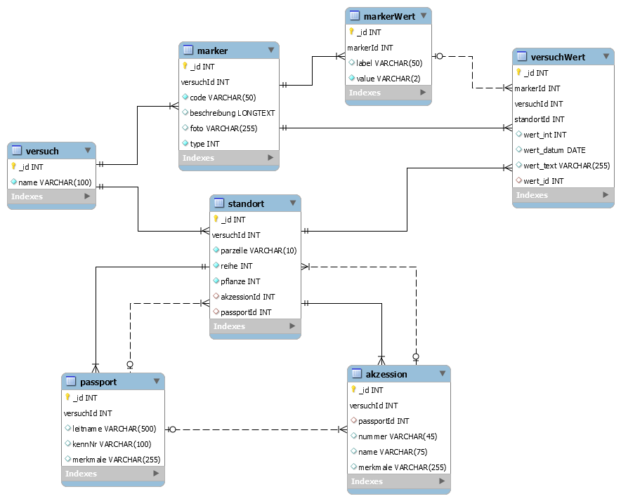

 JKI Bonitur
===========

Ordnerstruktur
--------------
      app/                                                                                  
      +--build/                                                                             
      +-+src/                                                                               
      | +-+assets/                                                                          
      | | +--fonts                          externe Schriftarten                            
      | +-+java/                                                                            
      | | +-+de/bund/jki/jki_bonitur        Hauptentwicklungsordner                         
      | |   +--config/                      Standardkonfiguration der App                   
      | |   +--db/                          Datenbank + Datenbankobjekte                    
      | |   +--dialoge/                     Ansteuerrung der verschiedenen Dialoge          
      | |   +--excel/                       Reader+Writer für Excel+CSV                     
      | |   +--lib/                         extern Java-Bibliotheken                        
      | |   +--tools/                       kleine Helferlein für die App                   
      | +-+res/                             Android-Resourcen                               
      |   +--/drawable                      Grafiken                                        
      |   +--/layout                        GUI                                             
      |   +--/values                        Standardwerte                                   
      |   +--/values-***                    Abweichende Werte für unterschieliche Größen    
      +--docs/                              zukünftig mehr Dokumente                        

Datenbank
---------
